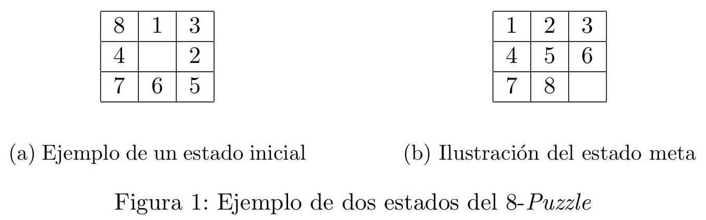
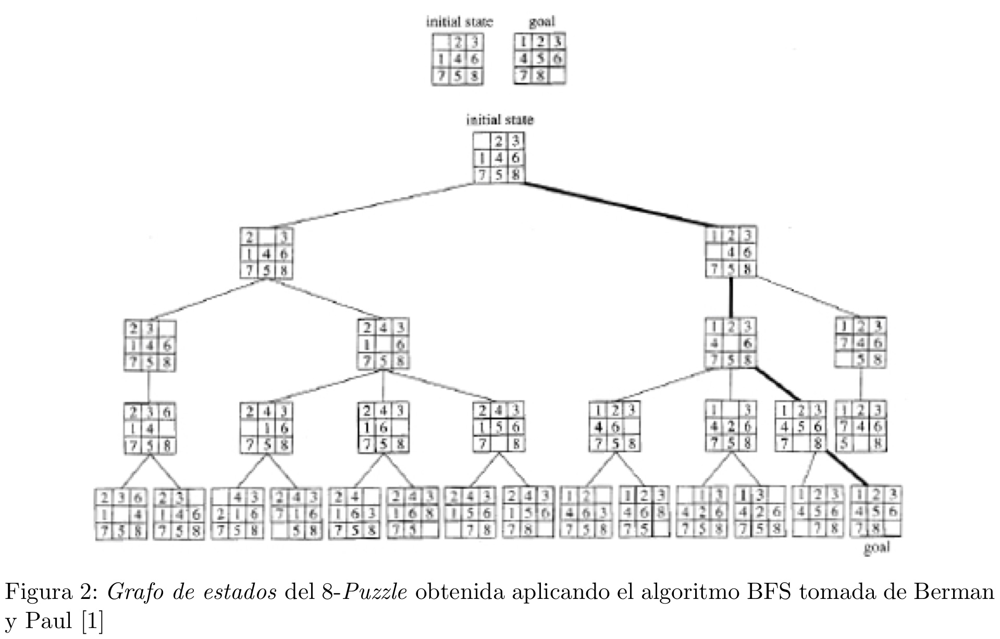
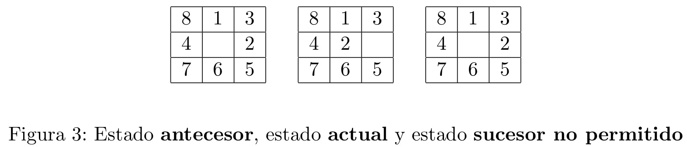

# 8Puzzle

## Implementación de una solución del 8-Puzzle con A∗

### 1. Introducción
El objetivo de este proyecto es el de resolver el problema del 8-Puzzle con un algoritmo
de búsqueda A*. El algoritmo A∗
es un algoritmo informado de búsqueda de caminos de costo
m´ınimo. Para este proyecto se le sugiere implementar la versión del algoritmo A∗ que se encuentra
en la sección V.4 del libro Meza y Ortega [2], la cual est´a basada en el Modelo General de Etiquetamiento.


### 2. Descripción del problema
El problema de 8-Puzzle [4] consiste en un tablero 3x3, el cual contiene 8 bloques cuadrados numerados (desde el 1 hasta el 8) y un cuadrado vacío (en nuestra representación será numerado con 0). Los cuadrados adyacentes al cuadrado vacío pueden moverse a ese espacio, y entonces dejar el espacio que ocupaba como cuadrado vacío. El objetivo es mover los cuadrados a partir de una configuración inicial del tablero, que llamamos estado inicial, hasta alcanzar una configuración específica que llamaremos estado meta. En la figuras 1a y 1b muestran un ejemplo de un estado inicial y el estado meta del 8-Puzzle respectivamente.



La formulación del del 8-Puzzle contiene los siguientes elementos:

* **Estados**: Un estado que indica la posición de cada uno de los nueve cuadrados dentro del tablero.
* **Estado inicial**: Un estado con en el que se inicia el problema.
Estado meta: Un estado que se quiere alcanzar a partir de un estado inicial.
* **Acciones**: Dado un estado, las acciones posibles a ejecutar son las de mover un cuadrado hacia el espacio vacío, aplicando un movimiento del cuadrado en alguna de las siguientes direcciones: izquierda, derecha, arriba y abajo.
* **Función para obtener sucesores**: A partir de un estado se generan los estados factibles o válidos que resultan de las cuatros posibles acciones indicadas anteriormente.
* **Grafo de estados**: Es un grafo en el cual los vértices son estados. Existe un lado entre un estado A y un estado B, si es posible llegar desde el estado A hasta el estado B. Esto es, el estado B es un estado sucesor del estado A que se obtiene por medio de una de aplicar la función para obtener sucesores al estado A.
* **Costo del camino**: Cada movimiento o paso en el tablero tiene un costo de uno. Se puede construir un camino en el Grafo de estados que representa cada uno de los movimientos que se efectuán desde un estado inicial hasta un estado final. En costo de ese camino es igual al número de pasos (o movimientos) que se dan para alcanzar el estado meta.
* **Función de prueba de meta**: Determina si un estado es el estado meta.


En la Figura 2 se puede observar el Grafo de estados que se obtiene al resolver el 8-Puzzle con el algoritmo de Búsqueda en Amplitud. El objetivo en este proyecto es encontrar el camino más corto desde el estado inicial, hasta el estado meta usando el algoritmo A∗. También en la Figura 2 se muestra el camino más corto resaltado.




### 3. Detalles de disen ̃o e implementación

#### 3.1. Sobre el grafo a utilizar
El grafo a usar para resolver este problema es un grafo implícito. Esto es, el Grafo de estados se va construyendo a partir del estado inicial, con el cual se obtienen los estados sucesores, con la función para obtener sucesores, hasta que se alcanza el estado meta. Es decir, no se guarda el grafo completo, que es todas las posibles combinaciones del posibles del tablero, en memoria; por el contrario se van almacenando los estados que se van observando a medida que se expande un estado dado.

#### 3.2. Heurísticas a implementar
Se deben implementar cuatro heurísticas o costos estimados a la meta `h( )`:

1.- **Zero**: En esta heurística todo estado da como resultado zero. Es decir, para cualquier estado n, se tiene que `h(n) = 0`.

2.- **Distancia Manhattan**: Es la suma de las distancias, verticales y horizontales, de cada
uno de los bloques, a su posición en el estado meta.

3.- **Número de cuadros desordenados**: Es el número de bloques en posiciones equivocadas, es decir, diferentes a las que corresponden al estado meta. La idea detrás de esta heurística es que mientras más desordenado está el tablero, más difícil debe ser ordenarlo.

4.- **Blanco**: Distancia entre la posición en el estado meta del cuadrado blanco y su posición actual.

Por ejemplo, dado los estados inicial y final de la figura 1, se tiene que el cálculo de las heurísticas es como sigue:

1.- **Zero**: 0
2.- **Distancia Manhattan**:

	Cuadro    | 1 | 2 | 3 | 4 | 5 | 6 | 7 | 8 |
	Distancia | 1 | 2 | 2 | 0 | 0 | 2 | 0 | 3 |
Total: 1 + 2 + 2 + 0 + 0 + 2 + 0 + 3 = 10

3.- **Número de cuadros desordenados**:

	Cuadro    | 1 | 2 | 3 | 4 | 5 | 6 | 7 | 8 |
	Distancia | 1 | 1 | 0 | 0 | 1 | 1 | 0 | 1 |
Total: 1 + 1 + 0 + 0 + 1 + 1 + 0 + 1 = 5

4.- **Blanco**: 2


#### 3.3. Evitando explorar estados visitados anteriormente

Al resolver este problema con el algoritmo A∗, tenemos que es posible visitar el mismo estado o tablero varias veces. Para prevenir la exploración innecesaria de estados, cuando se considere los estados sucesores de un estado actual, se debe evitar generar un estado que sea igual que el estado antecesor al estado actual o algún otro estado que ya sea parte del Grafo de estados. En la Figura 3 se muestra un estado sucesor de un estado actual, el cual no debe ser abierto.



#### 3.4. Detección de puzzles que no se pueden resolver

Desde cualquier tablero inicial no siempre es posible alcanzar el estado meta. El programa debe detectar si un tablero se puede resolver o no. El número de tableros posibles en el 8-Puzzle es igual al número de permutaciones de 9 elementos, es decir, 9! = 362880. Se tiene que 8-Puzzle, tiene la propiedad de que está compuesto por 2 grafos desconectados, cada uno conteniendo 9!/2 = 181440 estados [3]. Por lo que se hace imperativo tener una forma eficiente de detectar si un estado se puede resolver o no. En la sección de anexos se presenta un procedimiento para determinar si un tablero se puede resolver o no, el cual debe implementar.


### 4. Entrada y Salida de los datos

#### 4.1. Entrada de los datos

Debe hacer un programa llamado Puzzle8.java que se podrá ejecutar desde la consola con el siguiente comando:

```>java Puzzle8 <heurı ́stica> <instancia>```

Donde `heurística` indica la función heurística a utilizar y puede tomar cuatro valores:

	1. z: Zero.
	2. d: Número de cuadros desordenados.
	3. m: Distancia Manhattan.
	4. b: Blanco.

Se tiene que `instancia` es el nombre de un archivo con los datos del tablero, el cual es representado con tres filas y tres columnas de números desde el 0 hasta el 8, separados por espacio.

Si en la entrada no se indica una heurística y/o una instancia, entonces se debe dar un mensaje de error al usuario.

#### 4.2. Salida de los datos

Si el tablero no se puede resolver se debe imprimir por la salida estándar la frase **“No hay solución”**. En caso de haber una solución la salida, deberá mostrar los siguientes datos:

(i) la secuencia de los tableros que resuelven el puzzle y que componen el camino de costo mínimo. El formato del tablero es el mismo del de la entrada y despúes cada tablero se separa del otro con un salto de línea,

(ii) sigue una línea en blanco para luego tenerse una línea con el número de estados abiertos,

(iii) una línea con tiempo de ejecución del algoritmo A∗ en milisegundos.

####4.3. Ejemplos prácticos

##### 4.3.1. Ejemplo con tablero que no tiene solución

Dado un tablero inicial almacenado en un archivo llamado datos1.txt con el siguiente contenido:

```
1 2 3
4 5 6
8 0 7
```

Al ejecutar el comando:

```>java Puzzle8 z datos1.txt``


Se debe obtener la siguiente salida:

```No hay solución```

4.3.2. Ejemplo con tablero que tiene solución

Dado el siguiente archivo de entrada datos2.txt

```
0 1 3
4 2 5
7 8 6
```

Al ejecutar el comando:

```>java Puzzle8 m datos2.txt```

Se muestra un ejemplo de una salida factible:
```
0 1 3
4 2 5
7 8 6

1 0 3
4 2 5
7 8 6

1 2 3
4 0 5
7 8 6

1 2 3
4 5 0
7 8 6

1 2 3
4 5 6
7 8 0

Numero de estados abiertos: 10
Tiempo: 3 ms
```


### Referencias

[1] Berman, K., and Paul, J. *Fundamentals of Sequential and Parallel Algorithms*. PWS Publishing Co. Boston, MA, USA, 1996.

[2] Ortega, M., and Meza, O. *Grafos y Algoritmos*. Equinoccio, 2006.

[3] Reinefeld, A. *Complete Solution of the Eight-Puzzle and the Benet of Node Ordering in
IDA*. In Procs. Int. Joint Conf. on AI, Chambery (1993), pp. 248–253.

[4] Russel, S., and Norvig. *Artificial Intelligence*. Prentice-Hall, 2003.


### Apéndice: Procedimiento para determinar si se puede resolver o no el 8-Puzzle

```
Here is a simple rule for telling if an 8 puzzle is solvable.

Recall that our goal state is:

1 2 3
4 5 6
7 8 0

where the 0 represents the blank.

Now, consider the following arrangement of tiles:

1 2 3
4 5 7
6 8 0

The first line is in the correct order. The second line is correct except that counter 7 comes before counter 6. We can call this violation of the order an "inversion".

If the number of inversions is even then the puzzle is solvable. If the number of inversions is odd then the puzzle is unsolvable.

Consider the puzzle:

2 4 3
1 0 6
7 5 8

We have the following inversions:

   2 comes before 1
   4 comes before 3 and 1
   3 comes before 1
   6 comes before 5
   7 comes before 5

 For a total of 6 inversions. This puzzle is solvable.
 Note that we don’t need to consider the blank (0).

 More examples:

 1 5 8
 0 2 3
 4 6 7

  5 comes before 2 3 4
  8 comes before 2 3 4 6 7

For a total of 8 inversions. This puzzle is solvable.

5 1 8
0 2 3
4 6 7

  5 comes before 1 2 3 4
  8 comes before 2 3 4 6 7

for a total of 9 inversions. This puzzle is not solvable.

2 0 7
8 5 4
3 6 1

  2 comes before 1
  7 comes before 5 4 3 6 1
  8 comes before 5 4 3 6 1
  5 comes before 4 3 1
  4 comes before 3 1
  3 comes before 1
  6 comes before 1

for a total of 18 inversions. This puzzle is solvable.

8 7 6
5 4 3
2 1 0

  8 comes before 7 6 5 4 3 2 1
  7 comes before 6 5 4 3 2 1
  6 comes before 5 4 3 2 1
  5 comes before 4 3 2 1
  4 comes before 3 2 1
  3 comes before 2 1
  2 comes before 1

for a total of 28 inversions. This puzzle is solvable
(although you may run out of memory before finding a solution).
